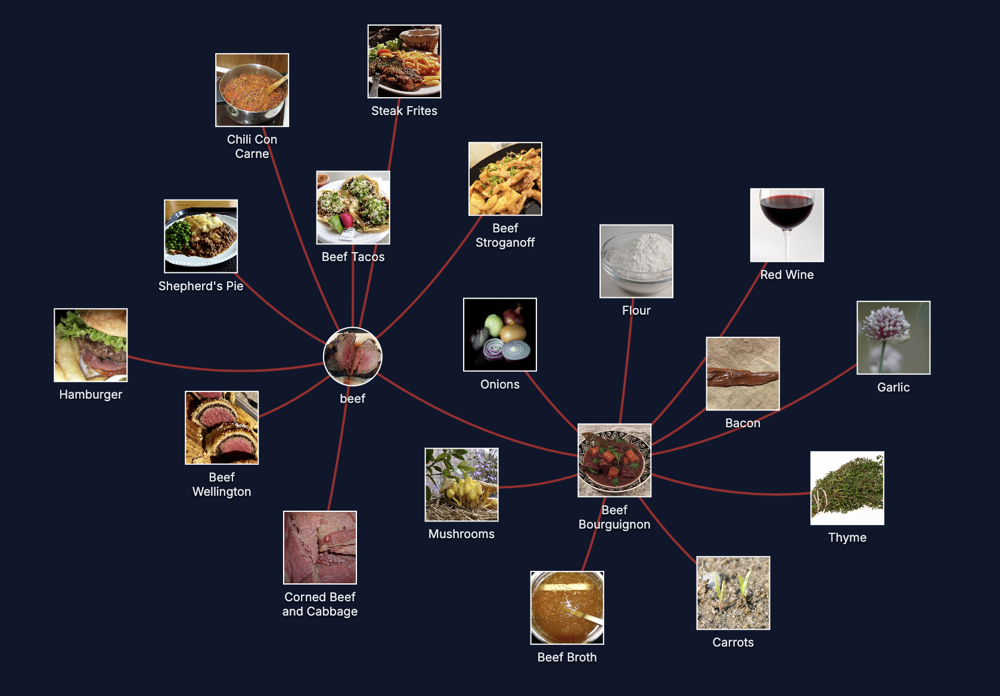
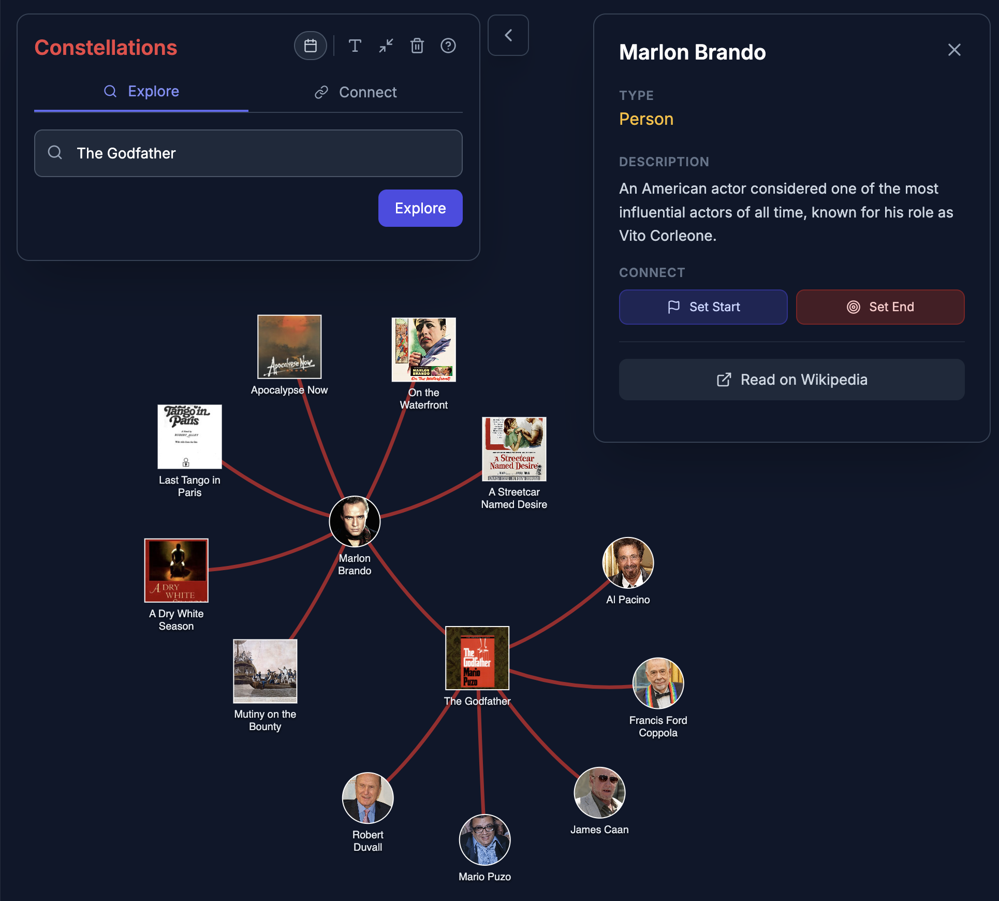
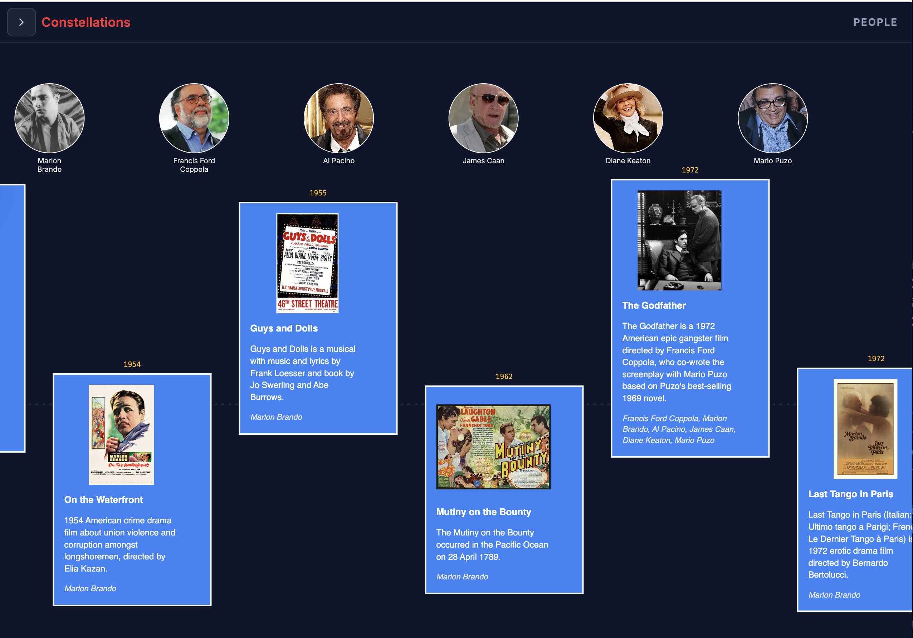
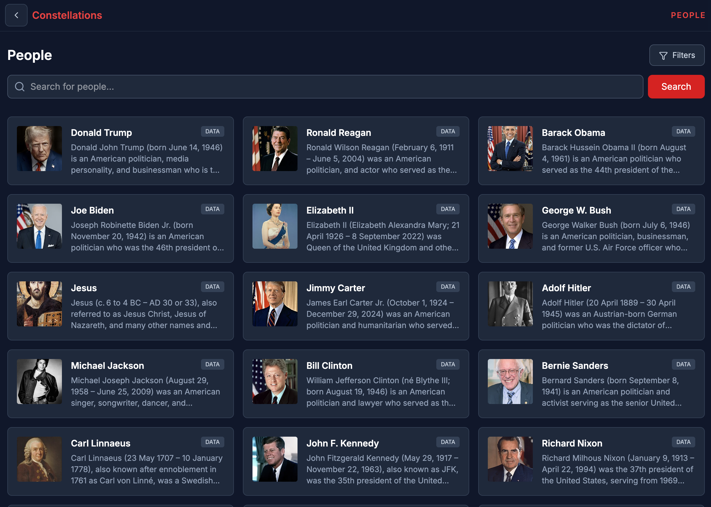

# 🌌 Constellations

**Universal, AI-powered bipartite knowledge graphs.**

[](https://news.ycombinator.com/)
[](https://opensource.org/licenses/MIT)

**[Live Demo](https://constellations-delta.vercel.app/)** | **[LinkedIn Post](https://www.linkedin.com/feed/update/urn:li:activity:7409328608910946304/)**

<div align="center">
<video src="https://github.com/user-attachments/assets/8c9fb0b0-967e-4285-a71c-c922de8b245a" width="100%" autoplay muted controls playsinline></video>
</div>

## The Evolution: From History to Everything

Originally designed to map world history, **Constellations** has evolved into a **Universal Bipartite Explorer**. It uses LLMs to identify the fundamental "Atomic" building blocks and the "Composite" collections that connect them in any domain.

### Locked bipartite pairs (chosen once at the start)
Constellations now **locks a single bipartite pair per graph**, chosen from the **first input node** (and then **does not switch**):
- **Person ↔ Event**
- **Ingredient ↔ Recipe**
- **Symptom ↔ Disease**
- **Author ↔ Paper**

This makes exploration more reliable (no mid-graph “ontology drift”), while still supporting multiple domains.

### Domains + text input (single unified UI)
Constellations supports both free text search and curated domain seed lists in the same UI:
- **Pick a domain** and tap a seed to begin quickly.
- **Or type** any query to start from an arbitrary entity.
- **Curate domains/seeds in-app**: add `?admin=1`

### Universal Examples:
| Culinary (Beef) | Sports (LeBron James) | Medicine (Sore Throat) |
| :---: | :---: | :---: |
|  |  |  |

## Philosophy & Design

The core idea is to create collaboration graphs on the fly with **zero pre-computed database**. The graph constructs a local neighborhood around a given node using live LLM queries and expands outward.

### The Bipartite Realization
The app strictly follows a bipartite structure:
- **Atomic Nodes** (Circles): Fundamental entities (People, Ingredients, Symptoms).
- **Composite Nodes** (Cards): Collections or events that bring Atomics together (Movies, Recipes, Diseases).
- **Edges**: Only connect Atomics to the Composites they belong to.

This prevents "hallucinated connections" and forces a logical structure onto the space. The AI explains its classification reasoning in the sidebar for every node, and the chosen bipartite pair is locked at the start of each graph.



## Vibe Coding: The Journey

This project was 100% "vibe coded" from start to finish—presenting problems to AI agents and iterating on their solutions. The journey took me through the current landscape of AI development tools:

1.  **Google AI Studio**: A great start, but I pushed it too far and it took a wrong turn. When it couldn't revert a day's worth of work, I had to "liberate" the project.
2.  **Antigravity**: My second stop, which worked well until I hit my quota.
3.  **Cursor**: Where I spent the bulk of the time. It’s a powerful tool but occasionally the "weakest link"—prone to doom loops and finding the best solution only after exhausting every possible alternative.
4.  **Codex**: When Cursor stalled on complex save/restore and export/import logic, Codex stepped in to finish the job. It was a step up in logic, though not cheap!

**Methodology**: I tried to present the agents with problems and kept my own implementation ideas to myself until I saw what they came up with. I've learned that the "Aha!" moment often comes from the agent's alternative path.

## Key Views

### Network & Timeline
The graph engine is built on **D3.js**, using a custom force-directed layout (`forceSimulation`, `forceLink`, `forceManyBody`, `forceCenter`, and collision detection). You can switch between the network view and a chronological timeline with one click.



### Path-seeking
Trace connections across history. Here is a path from **John von Neumann** to **Geoffrey Hinton**:


### Browse People
For inspiration, I scored the 5,000 "top" biographies from Simple Wikipedia based on log article length and link density. It's a fascinating, if occasionally quirky, cross-section of world history.



## Technical Architecture

- **Live Queries**: Uses **Gemini** models to identify connections on the fly (configurable via `VITE_GEMINI_MODEL`).
- **Multi-source context + metadata**: Uses **Wikipedia/Wikidata** plus **academic corpora/metadata APIs** (currently OpenAlex, with Crossref/DOI metadata as a fallback) when helpful.
- **Image Logic**: Currently queries **Wikipedia Commons** for images rather than the LLM (which the agents claimed would be too error-prone, though the current way has its own quirks!).
- **Persistence**: Saved graphs and LLM responses are cached in a **PostgreSQL (Supabase)** database to reduce tokens and speed up recurring paths.
- **Frontend**: React 19 + Tailwind CSS.

## Getting Started

1. **Clone & Install**:
   ```bash
   git clone https://github.com/johndimm/Constellations.git
   cd Constellations
   npm install
   ```

2. **Setup Env**:
   Create a `.env` file with your Gemini API key and Supabase URL.
   ```env
   VITE_GEMINI_API_KEY=your_key_here
   # Optional:
   VITE_GEMINI_MODEL=gemini-2.5-flash
   VITE_GEMINI_MODEL_CLASSIFY=gemini-2.5-pro
   DATABASE_URL=your_postgres_url
   ```

3. **Run**:
   ```bash
   npm run start:cache  # Starts the backend (cache/db)
   npm run dev          # Starts the frontend
   ```

---

*Built with ❤️ and a small army of AI agents.*

